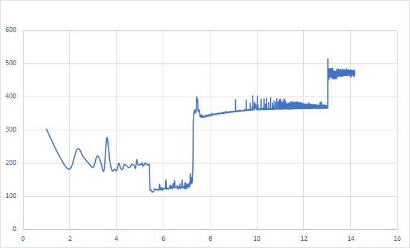
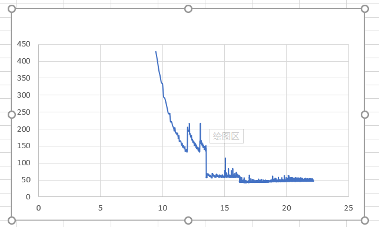

# nvm_buffer_prober
buffer prober tests on Optane DIMM

load buffer probe
```
g++ nvm_buffer_load.cpp -o nvm_buffer_load -march=native -std=c++11
./nvm_buffer_load
```


store buffer probe
```
g++ nvm_buffer_store.cpp -o nvm_buffer_store -march=native -std=c++11
./nvm_buffer_store
```

